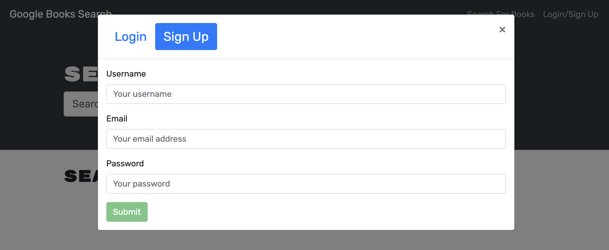
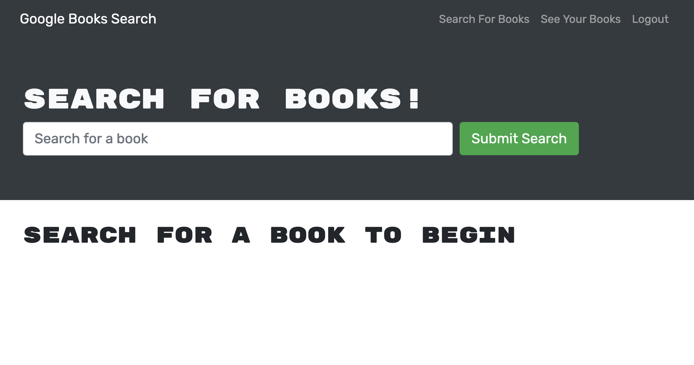
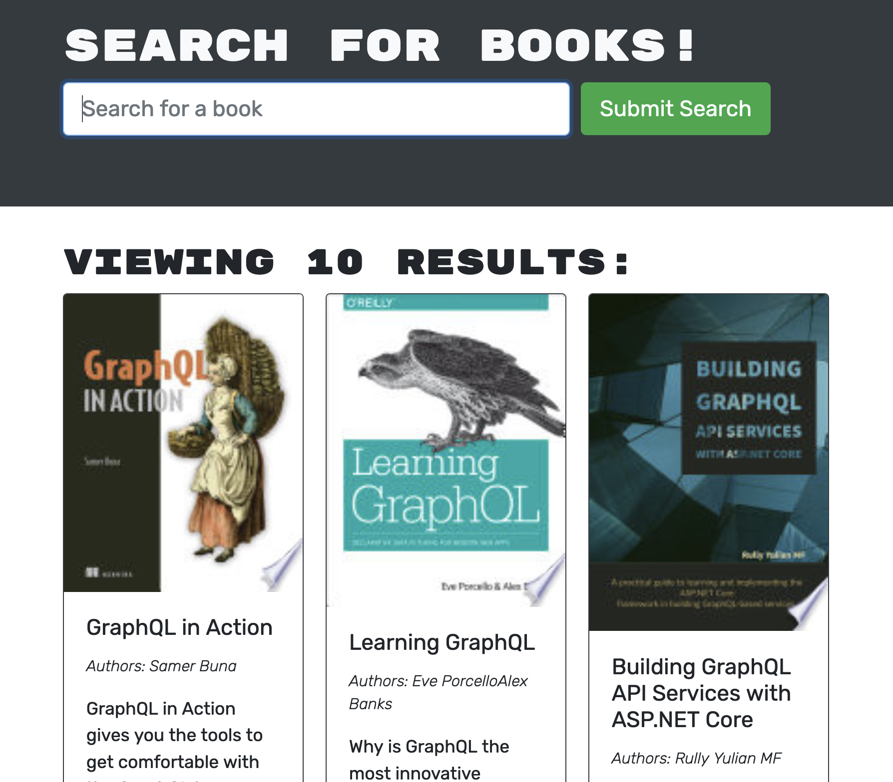
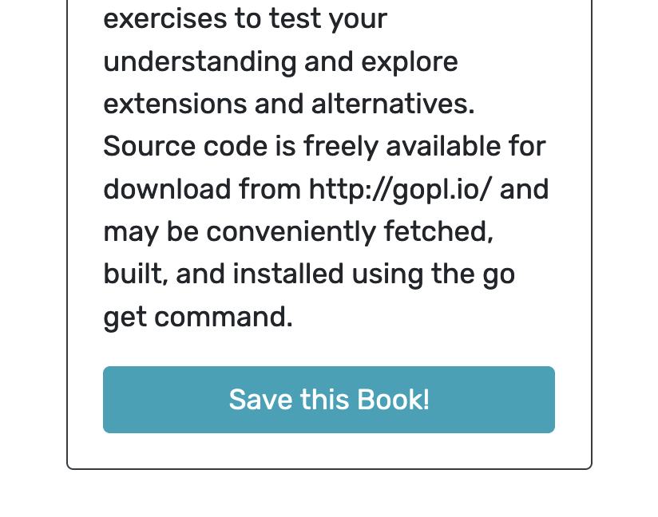
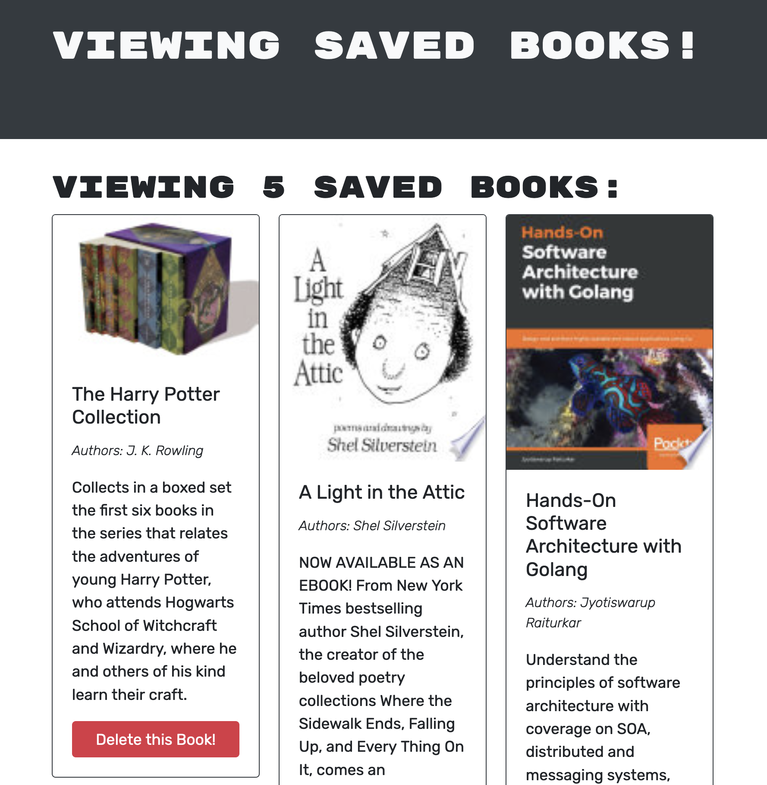

# Book Search Engine

## Table of Contents
* [Description](#description)
* [Usage](#usage)
* [License](#license)

## Description
This is a book search engine that allows users to search for books and save them to their profile. The application uses the Google Books API to search for books and uses GraphQL to query and mutate data. This application was initially built with a RESTful API and was refactored to be a GraphQL API built with Apollo Server.

## Usage
To use this application, go to the deployed application on Heroku and create an account. Once you have created an account, you can search for books and save them to your profile.

You need to provide a username, email, and password in the sign up form.
 

Here's the landing page for the application. The header contains a navigation bar and a prominent search bar. The search bar allows you to search for books by title or author.
 

The search results are displayed in staggered grid. Each book has a title, author, description, and a button to save the book to your profile that will only show if you are logged in. The description is not truncated, so it may be long depending on the book and can elongate the card to comically large proportions. That can be fixed in a future update.
 

	
	

The saved books page displays all of the books that you have saved to your profile. You can remove books from your profile by clicking the "Delete this Book!" button on that book's card.
 

## License
This project is licensed under the terms of the MIT license.

